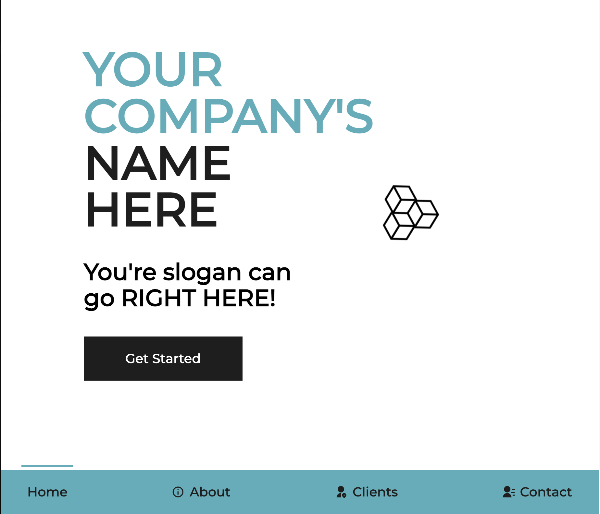
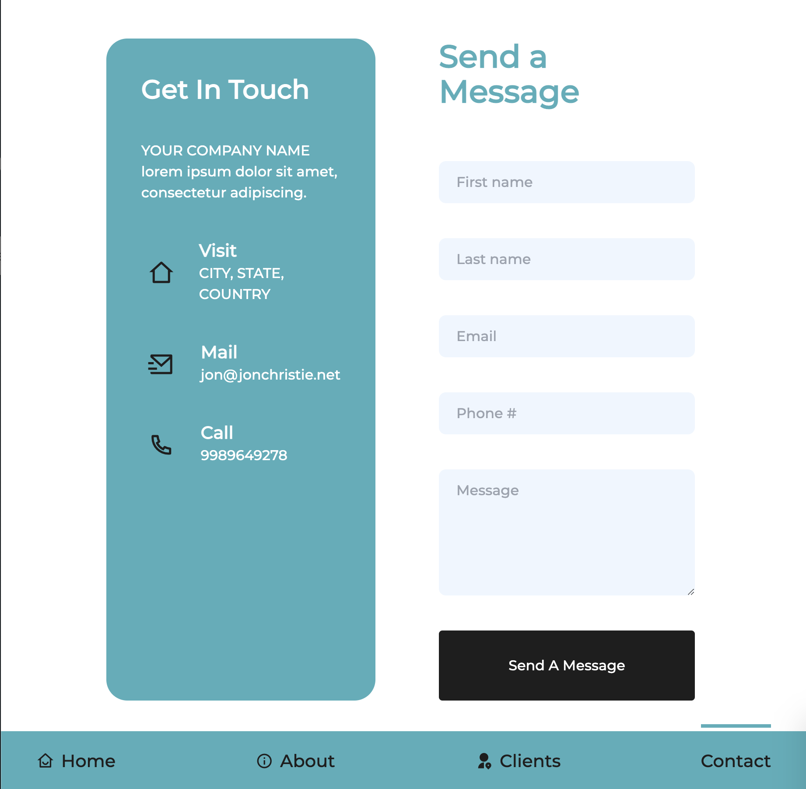
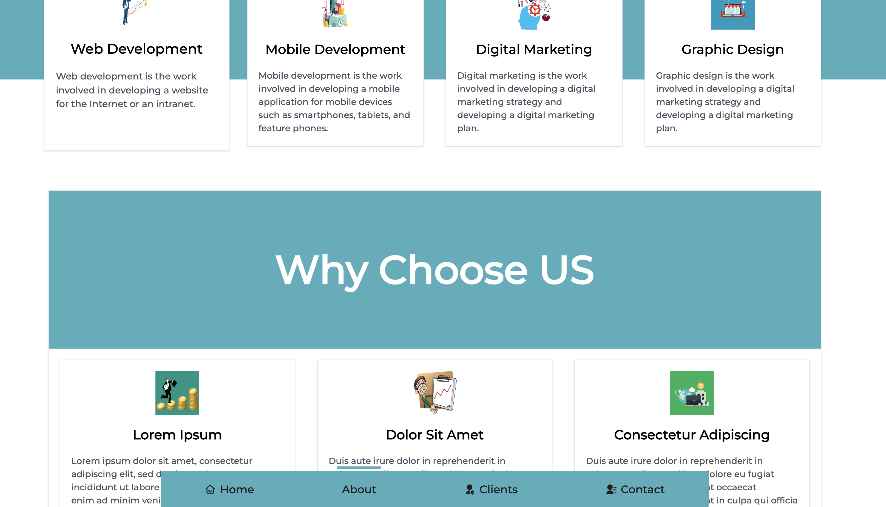
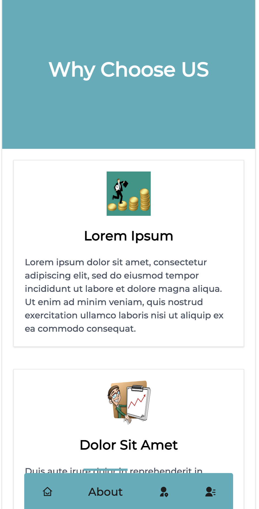
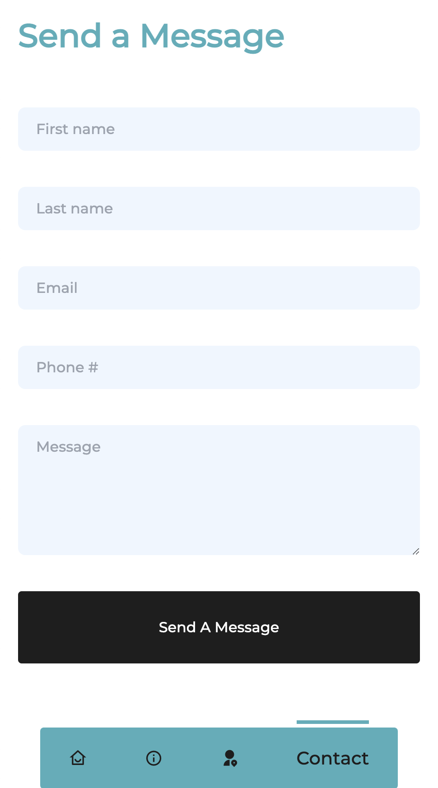

# Marketing App

A demo application for marketing purposes. Built with React using TypeScript and TailwindCSS.

[LIVE](https://marketing-app-demo.vercel.app/)

# Table of Contents
- [Screenshots](#screenshots)
- [Getting Started](#getting-started)
- [Features](#features)
- [Contributing](#contributing)
- [License](#license)
- [Contact](#contact)

# Screenshots







# Getting Started
You can use this project as a template for your own project. Start by following the commands below.
```
npm i
npm start
```

# Features
- React
- TypeScript
- TailwindCSS
- Vercel
- lottie-web
- react-router-dom
- react-dom
- @heroicons/react
- @headlessui/react
- Modals

# Contributing
Contributions are always welcome! Please read the [contribution guidelines](./CONTRIBUTING.md) first.

# License
[MIT](./LICENSE)

# Contact


__Jon Christie__ 

GitHub: [mathcodes](https://github.com/mathcodes) 

[<code></code>](https://www.linkedin.com/jonchristie)       
[<code></code>](https://twitter.com/thejonchristie)       
[<code></code>](https://www.youtube.com/channel/UC5GFnN-lv8Yuqc9O3b79k6g)       
[<code></code>](https://www.facebook.com/jonpchristie)       
[<code></code>](https://www.instagram.com/fullstack11235)       
[<code></code>](https://soundcloud.com/jonchristie#/)       
[<code></code>](https://open.spotify.com/artist/07S7aLfxH70VAX64g1WuFw?si=tlOj1OMBRLm-y4sY8Lox3Q)

